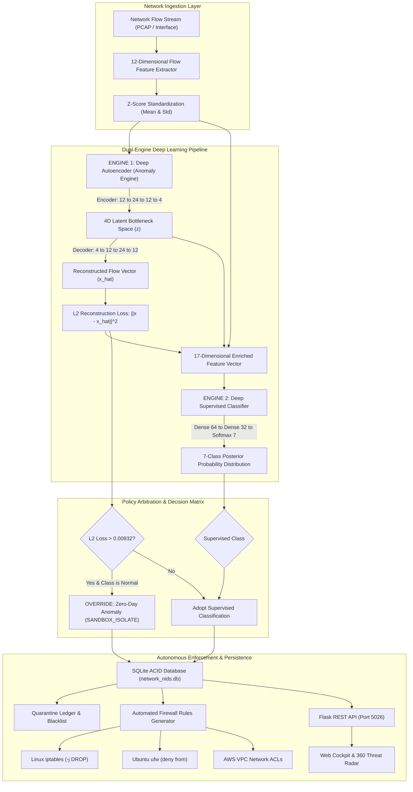

# 03. System Architecture & Topology Design (PROJECT-026)

```mermaid
flowchart TD
    subgraph INGESTION["Network Ingestion Layer"]
        A["Network Flow Stream (PCAP / Interface)"] --> B["12-Dimensional Flow Feature Extractor"]
        B --> C["Z-Score Standardization (Mean & Std)"]
    end

    subgraph DUAL_ENGINE["Dual-Engine Deep Learning Pipeline"]
        C --> D["ENGINE 1: Deep Autoencoder (Anomaly Engine)"]
        D -->|Encoder: 12 to 24 to 12 to 4| E["4D Latent Bottleneck Space (z)"]
        E -->|Decoder: 4 to 12 to 24 to 12| F["Reconstructed Flow Vector (x_hat)"]
        F --> G["L2 Reconstruction Loss: ||x - x_hat||^2"]
        
        C & E & G --> H["17-Dimensional Enriched Feature Vector"]
        H --> I["ENGINE 2: Deep Supervised Classifier"]
        I -->|Dense 64 to Dense 32 to Softmax 7| J["7-Class Posterior Probability Distribution"]
    end

    subgraph ARBITRATION["Policy Arbitration & Decision Matrix"]
        G --> K{"L2 Loss > 0.00932?"}
        J --> L{"Supervised Class"}
        K -->|Yes & Class is Normal| M["OVERRIDE: Zero-Day Anomaly (SANDBOX_ISOLATE)"]
        K -->|No| N["Adopt Supervised Classification"]
        L --> N
    end

    subgraph ENFORCEMENT["Autonomous Enforcement & Persistence"]
        M & N --> O["SQLite ACID Database (network_nids.db)"]
        O --> P["Quarantine Ledger & Blacklist"]
        O --> Q["Automated Firewall Rules Generator"]
        Q --> R["Linux iptables (-j DROP)"]
        Q --> S["Ubuntu ufw (deny from)"]
        Q --> T["AWS VPC Network ACLs"]
        O --> U["Flask REST API (Port 5026)"]
        U --> V["Web Cockpit & 360 Threat Radar"]
    end
```
